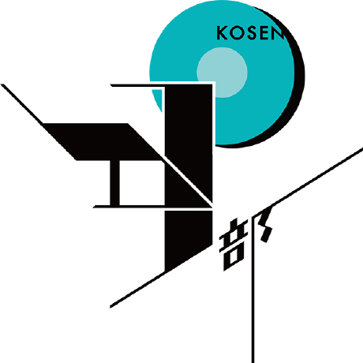

# Dive into the community
subtitle
: 2018-07-15 DMMグループセミナールーム

subtitle
: kosenconf in Tokyo 2018

author
: うなすけ

theme
: unasuke-white

# 自己紹介
- 名前 : うなすけ
  - 出身 : 福井高専(2015年卒)
- 所属 : 株式会社バンク (エンジニア)
  - インフラ寄りサーバーサイドエンジニア
- GitHub [@unasuke](https://github.com/unasuke)
- Twitter [@yu\_suke1994](https://twitter.com/yu_suke1994)
- Mastodon [@unasuke@mstdn.maud.io](https://mstdn.maud.io/@unasuke)

{:relative_width="24" align="right" relative_margin_right="-10" relative_margin_top="42"}

# ちょっと宣伝
{:relative_width="100"}

# ちょっと宣伝
{:relative_width="100"}

# ちょっと宣伝
{:relative_width="100"}

# ちょっと宣伝
{:relative_height="100"}

# ちょっと宣伝
{:relative_height="100"}

# 多様化する技術との巡りあい

{::tag name="center"}
「多様化する技術との巡りあい」 #とは
{:/tag}

# 多様化する技術との巡りあい
- 技術？
  - 機械
  - 電気
  - 情報
  - 化学
  - 環境都市
  - etc...

# 多様化する技術との巡りあい
- 技術？
  - 機械
  - 電気
  - 情報 ← ぼくこれ
  - 化学
  - 環境都市
  - etc...

# Dive into the community
- どんなコミュニティに所属していますか？
  - kosenconf
  - ？

# 僕が所属しているコミュニティ
- kosenconf
- kosen10s
- kosendj-bu
- Asakusa.rbなど地域Ruby
- 情報科学若手の会
- etc...

# 僕が所属しているコミュニティ
- kosenconf ← 技術系？
- kosen10s ← 技術系
- kosendj-bu ← 技術系(DJ技術)
- Asakusa.rbなど地域Ruby ← 技術系
- 情報科学若手の会 ← 技術系
- etc...

# コミュニティと技術
- そもそも、なぜコミュニティに属するのか？
  - 同じ界隈の人達とワイワイやっていきたい
    - 言語、フレームワーク、地域……
  - わからないところを質問したい
    - コミュニティには詳しい人が居るかも？
  - 知らない知見に出会いたい
    - 他社事例
    - 話題、新着の何か

# 同じ界隈の人達とワイワイやっていきたい
{:relative_width="85"}

# わからないところを質問したい
{:relative_width="70"}

{::tag name="xx-small"}[https://twitter.com/yu\_suke1994/status/799151110065795072](https://twitter.com/yu_suke1994/status/799151110065795072){:/tag}

# わからないところを質問したい
{:relative_width="75"}

# 知らない知見に出会いたい
{:relative_width="100"}

# 知らない知見に出会いたい
{:relative_width="88"}

# 知らない知見に出会いたい

{::tag name="center"}
技術と巡りあう場としてのコミュニティ
{:/tag}

# コミュニティで技術と巡りあう
- 同じ界隈の人達とワイワイやっていきたい
  - コミュニティ内での認知
  - 情報が集まってくる
- わからないところを質問したい
  - 自分の技術力の向上
- 知らない知見に出会いたい
  - 技術との巡りあい

# コミュニティとの出会い方
- tweetから
  - 界隈で有名な人をwatch
    - その人はどうやって見つける？
- イベントサイトから
  - [https://connpass.com](https://connpass.com)
  - [https://techplay.jp](https://techplay.jp)
  - [https://www.doorkeeper.jp](https://www.doorkeeper.jp)

# 技術コミュニティに属するということ
- イベント、ミートアップ参加
- グループ
  - Slack
  - Discord
  - Facebook group

# 生存者バイアス
- 全ての人がコミュニティでうまくやっていけるか
  - 自分の成功体験を一般論にしているかも
- そもそもコミュニティに参加するのは度胸が……
  - どんなコミュニティも新人さん歓迎

# コミュニティのなかで生きる
- 「活発であるべき」というルールはない
  - コミュニティによる？
- 関わるのがつらいコミュニティからは逃げる
  - つらいなら所属すべきでない
  - 自分が快適な距離感をおく

# コミュニティを楽しむ
- できることが増える
  - いつの間にか成長している
    - 理想形
  - DJができるようになった
  - プログラミングスキル

# コミュニティに貢献する
- お手伝い
  - イベント開催
  - コミュニティ運営
  - 積極的な活動
- 新しい人を連れてくる

# 僕とコミュニティの今まで
- kosenconfがあったから就職できた
- kosendj-buがあったから音楽の楽しさが広がった
- kosen10sがあったから気のおけない友人が増えた
- 地域Rubyがあったから技術者として成長できている

# 僕とコミュニティの今まで
- kosenconf
  - 思い返せば全ての始まり
  - 学生生活
  - 就職
  - 界隈

# まとめ
- コミュニティを介して技術と出会う
- コミュニティ活動を楽しもう
  - 結果、技術が身につく(かも)
- kosenconf 10th aniv 👏👏👏
- 明日の高専DJ部に来てくれ頼む！！！！
